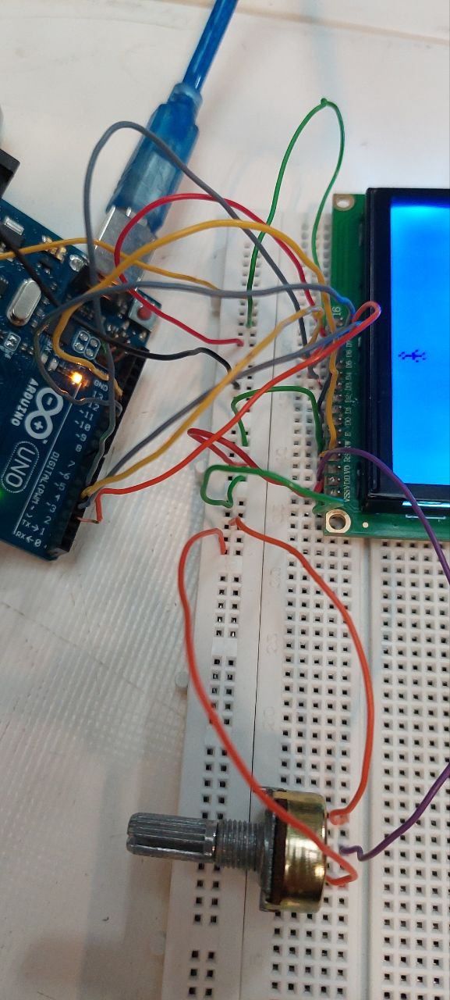

عنوان : برنامه ای بنویسید که الگوی زیر را روی ال سی دی کاراکتر نمایش دهد

𓁆𓀠𓁆𓀠𓁆𓀠...𓀠

𓀠.............𓁆

ابزار و تجهیزات :  ال سی دی کاراکتری ، برد بورد ، برد آردینو ، پتاسیم متر ، سیم مخابراتی

هدف : نمایش آدمک بطوری که در ستون های زوج دست هایش پایین و در ستون های فرد دست هایش بالا باشد.

"شرح" 

بخش مدار

برد آردینو را با کابل به سیستم متصل میکنیم
ال سی دی و پتاسیم متر را در بخش میانی برد  بورد متصل میکنیم
پایه سمت چپ و راست پتاسیم متر را به زمین برد بورد می‌بریم و پایه وسط آن را به پایه 3 ال سی دی متصل میکنیم 
و طبق جدول زیر ال سی دی و برد آردینو را  بهم متصل میکنیم

LCD    /   UNO
-------       --------
1,16     /   GND,

2,15     /   5v,

Rs        /   12,

Rw      /    GND,

E         /    11,

D4       /    5,

D5       /    4,

D6       /    3,

D7       /    2,





بخش کد

ابتدا با استفاده از 0 و 1  شکل ادمک ها را تعریف میکنیم
سپس با استفاده از حلقه و شرط زوج بودن شماره ستون ، برای ستون های زوج آدمک با دست های پایین فراخوانی و برای ستون فرد آدمک دست بالا صدا زده می شود

```ccp
#include <LiquidCrystal.h>
const int rs = 12, en = 11, d4 = 5, d5 = 4, d6 = 3, d7 = 2;
// پین‌های متصل به LCD
LiquidCrystal lcd(rs, en, d4, d5, d6, d7); 
// ایجاد یک شیء از کلاس LiquidCrystal
byte armsDown[8] = {
// تعریف شکل آدمک
  0b00100,
  0b01010,
  0b00100,
  0b00100,
  0b01110,
  0b10101,
  0b00100,
  0b01010
};

byte armsUp[8] = {
  0b00100,
  0b01010,
  0b00100,
  0b10101,
  0b01110,
  0b00100,
  0b00100,
  0b01010
};

void setup() {
  lcd.begin(16, 2);
  // راه‌اندازی LCD با ابعاد 16x2
  lcd.createChar(3, armsDown);
  // تعریف کاراکترهای سفارشی
  lcd.createChar(4, armsUp);
}

void loop() {
  // چاپ آدمک در ستون‌های زوج و فرد
  for (int i = 0; i < 16; i++) {
// ستونی که می‌خواهیم آدمک را چاپ کنیم
    lcd.setCursor(i, 0);
    if (i % 2 == 0) {
      lcd.write(3); // آدمک دست پایین
      delay(500);
      lcd.clear();
    } else {
      lcd.write(4);// آدمک دست بالا
      delay(500);
      lcd.clear();
    }
  }
//برای حرکت ادمک از ستون 16 به ستون 0
  for (int i = 15; i > -1; i--) {
    lcd.setCursor(i, 1);
    if (i % 2 == 0) {
      lcd.write(4);
      delay(500);
      lcd.clear();
    } else {
      lcd.write(3);
      delay(500);
      lcd.clear();
    }
  }
}
```

نتیجه :  پس از آپلود مشاهده میکنیم که الگو در خانه های زوج دست هایش پایین و در خانه های فرد دست هایش بالا است