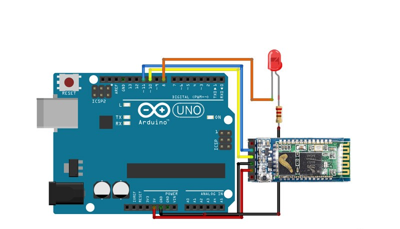

عنوان آزمایش : خاموش روشن کردن LED با ماژول بلوتوث

ابزار و تجهیزات : ماژول بلوتوث HC05 ، برد آردینو ، مقاومت

هدف : روشن شدن ال ای دی با ارسال عدد 1 و خاموش شدن با ارسال 0

شرح آزمایش

بخش مدار

ماژول بلوتوث و ال ای دی را روی برد برد قرار میدهیم
پایه RXD  و TXD ماژول بلوتوث را به ترتیب به پایه 10 و 11 آردینو وصل میکنیم
و پایه GND و VCC را به زمین و 5v آردینو متصل میشوند

پایه مثبت ال ای دی با یک مقاومت به زمین آردینو و پایه منفی آن به پین 8 آردینو متصل میکنیم

 

بخش کد

```cpp
#include <SoftwareSerial.h> // کتابخانه SoftwareSerial را شامل می‌شود که برای ارتباط سریال نرم‌افزاری استفاده می‌شود
SoftwareSerial MyBlue(10, 11); // RX | TX : تعریف یک شیء از نوع SoftwareSerial با پین‌های 10 به عنوان RX و 11 به عنوان TX
String flag; // تعریف یک متغیر از نوع String برای ذخیره داده‌های دریافتی
int LED = 8; // تعریف یک متغیر برای شماره پین LED که به پین 8 متصل است

void setup() 
{   
  Serial.begin(9600); // راه‌اندازی ارتباط سریال با سرعت 9600 بیت در ثانیه
  MyBlue.begin(9600); // راه‌اندازی ارتباط سریال نرم‌افزاری با سرعت 9600 بیت در ثانیه
  pinMode(LED, OUTPUT); // تنظیم پین LED به عنوان خروجی
  Serial.println("Ready to connect\nDefualt password is 1234 or 000"); // چاپ پیغام آماده بودن برای اتصال و رمز عبور پیش‌فرض
} 

void loop() 
{ 
  if (MyBlue.available()) // بررسی اینکه آیا داده‌ای از طریق ارتباط سریال نرم‌افزاری موجود است
    flag = MyBlue.read(); // خواندن داده دریافتی و ذخیره آن در متغیر flag
    flag.trim(); // حذف فضای خالی اضافی از ابتدای و انتهای رشته

  if (flag == '1') // اگر مقدار flag برابر با '1' باشد
  { 
    digitalWrite(LED, HIGH); // روشن کردن LED
    Serial.println("LED On"); // چاپ پیغام روشن بودن LED
  } 
  else if (flag == '0') // اگر مقدار flag برابر با '0' باشد
  { 
    digitalWrite(LED, LOW); // خاموش کردن LED (در اینجا باید LOW باشد، نه HIGH)
    Serial.println("LED Off"); // چاپ پیغام خاموش بودن LED
  } 
}
```
برای راه اندازی نیاز به نصب نرم افزار  BT TERMINAL است تا دستورات از این طریق ارسال شود
نتیجه گیری : پس از متصل کردن نرم افزار به ماژول بلوتوث با ارسال عدد 1 ال ای دی روشن و با پیام 0 ال ای دی خاموش می شود