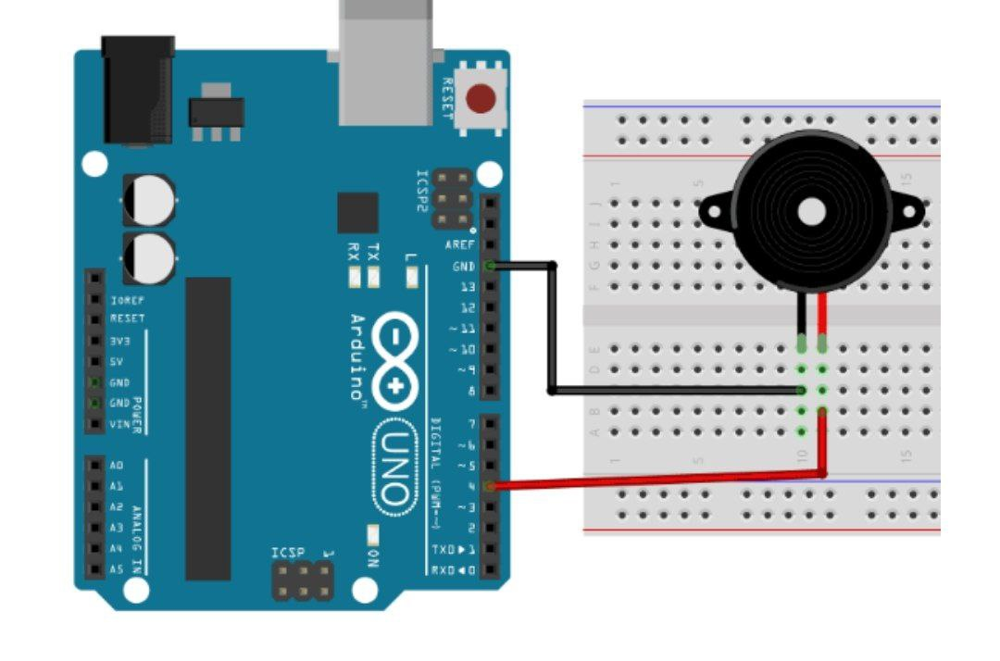

عنوان آزمایش : راه اندازی بازر

ابزار و تجهیزات : بازر ، برد بورد ، آردینو

هدف : به صدا در امدن بازر

شرح آزمایش

بخش مدار

بازر را روی برد بورد قرار داده پایه مثبت آن را به پایه ۱۰ برد آردینو و پایه منفی آن را به زمین وصل میکنیم

 

بخش کد
```cpp
void setup() {
    pinMode(buzzer, OUTPUT); // تنظیم پین بیزر به عنوان خروجی
}
void loop() {
    tone(buzzer, 1000); // تولید صدای با فرکانس 1000 هرتز
    delay(1000); // انتظار به مدت 1000 میلی‌ثانیه (1 ثانیه)
    noTone(buzzer); // خاموش کردن صدا
    delay(1000); // انتظار به مدت 1000 میلی‌ثانیه (1 ثانیه)
}
```
نتیجه گیر : پس از آپلود بازر به صدا در خواهد آمد