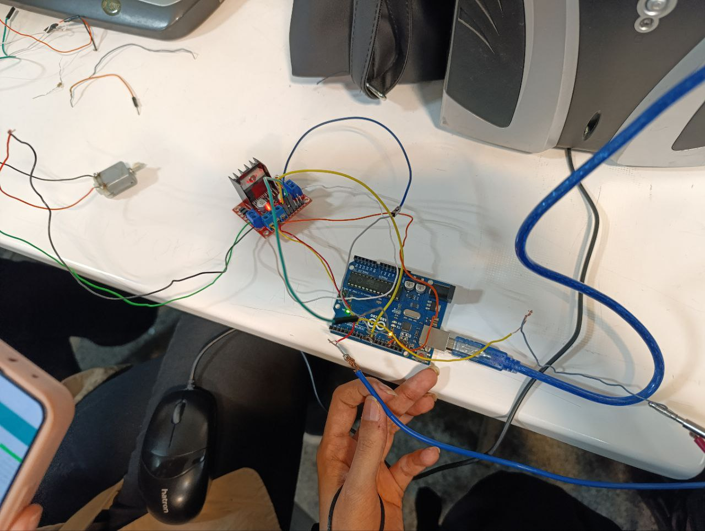

عنوان آزمایش : درایور موتور

ابزار و تجهیزات : درایور موتور ، آردینو ، موتور DC 

هدف : راه اندازی موتور DC با استفاده از درایور موتور

شرح آزمایش

بخش مدار

ابتدا موتور DC را به یکی از پایه های آبی رنگ چپ و راست درایور موتور متصل میکنیم

در پین اول پایه های آبی رنگ وسط درایور، سر مثبت منبع و در پین دوم آن سر منفی منبع و زمین آردینو را وصل میکنیم

پایه EN2 به پایه 10، پایه IN1 به پایه 9 و پایه IN2 را به پایه 8 آردینو وصل میکنیم

بخش کد

پین کنترل جهت موتور (مثلا چرخش به جلو) // ;const int in1 = 9
پین کنترل جهت موتور (مثلا چرخش به عقب) // ;const int in2 = 8
پین کنترل سرعت موتور // ;const int enable = 10
void setup() {
pinMode(in1, OUTPUT);
pinMode(in2, OUTPUT);
pinMode(enable, OUTPUT);
}
void loop() {
چرخش به جلو //
digitalWrite(in1, HIGH);
digitalWrite(in2, LOW);
analogWrite(enable, 255); // تنظیم سرعت موتور
مکث به مدت  2ثانیه // );delay(2000
چرخش به عقب //
digitalWrite(in1, LOW);
digitalWrite(in2, HIGH);
analogWrite(enable, 255); // تنظیم سرعت موتور
مکث به مدت  2ثانیه // );delay(2000
}

نتیجه گیری : موتور DC شروع به چرخش میکند.