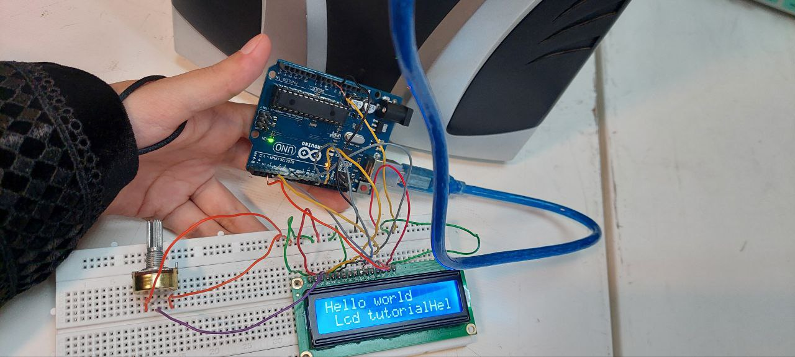

عنوان : نمایش یک عبارت روی ال سی دی

ابزار و تجهیزات : ال سی دی ،برد بورد،پتاسیم متر، برد آردینو،سیم مخابراتی


هدف : نمایش کاراکتر روی ال سی دی


"شرح"

بخش مدار

برد آردینو را با کابل به سیستم متصل میکنیم
ال سی دی و پتاسیم متر را در بخش میانی برد  بورد متصل میکنیم
پایه سمت چپ و راست پتاسیم متر را به زمین برد بورد می‌بریم و پایه وسط آن را به پایه 3 ال سی دی متصل میکنیم 
و طبق جدول زیر ال سی دی و برد آردینو را  بهم متصل میکنیم

LCD    /   UNO,

1,16   /    GND,

2,15   /    5v,

Rs      /    12,

Rw     /    GND,

E        /    11,

D4     /     5,

D5     /     4,

D6     /     3,

D7     /     2,




بخش کد

ابتدا پایه هایی از آردینو که درگیر هستند را تعریف میکنیم
سپس ابعاد  ال سی دی موجود را تعریف میکنیم (ردیف،ستون)
سپس کلمه یا جمله که می خواهیم ال سی دی نمایش دهد را با دستور پرینت مشخص میکنیم
و طبق کد زیر انجام می دهیم

```ccp
#include <LiquidCrystal.h>

LiquidCrystal lcd (12, 11, 5, 4, 3, 2);

// ایجاد یک شیء از کلاس LiquidCrystal

void setup() {
  lcd.begin(16, 2);  
// راه‌اندازی ال سی دی  با ابعاد 2×16
  lcd.clear();
//پاک کردن ال سی دی

}

void loop() {
  lcd.print("Hello world");  
// چاپ عبارت "hello world" روی ال سی دی
  lcd.setCursor(0, 1);
// شروع کاراکتر از خونه ردیف صفر و ستون یک
  lcd.print(" Lcd tutorial");
}
```


نتیجه : پس از آپلود جمله مورد نظر
 "hello world"
 روی ال سی دی نمایش داده می شود