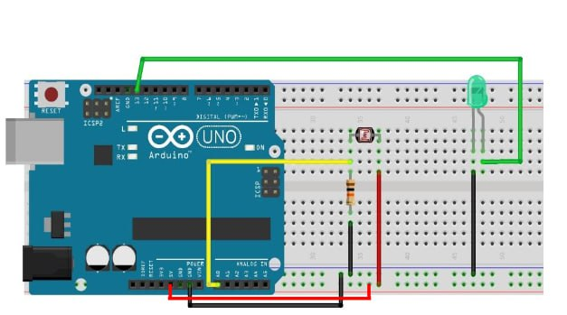

عنوان آزمایش : کنترل روشنایی ال ای دی با فوتوسل

ابزار و تجهیزات : ال ای دی ، فوتوسل ، مقاومت

هدف: کنترل روشن و خاموش شدن ال ای دی با فوتوسل

شرح آزمایش

بخش مدار 

فوتوسل را روی برد بورد قرار داده بکی از پایه هایش را به 5 ولت آردینو و پایه دیگر را به زمین و A0 وصل میکنیم

ال ای دی را نیز روی برد بورد قرار داده و پایه مثبت آن را به پایه ۱۳ برد آردینو و پایه منفی آن را به زمین وصل میکنیم

 

بخش کد
```cpp
int sensor; // متغیری برای ذخیره خوانش سنسور
int led = 13; // LED به پین دیجیتال 13 متصل است
void setup() {
    Serial.begin(9600); // راه‌اندازی ارتباط سریال با سرعت 9600
    pinMode(led, OUTPUT); // تنظیم پین LED به عنوان خروجی
}
void loop() {
    sensor = analogRead(A0); // خواندن مقدار سنسور از پین آنالوگ A0
    Serial.print("Sensor Value= ");
    Serial.println(sensor); // چاپ مقدار سنسور در مانیتور سریال
    delay(300); // انتظار به مدت 300 میلی‌ثانیه

    if (sensor > 800) {
        digitalWrite(led, LOW); // خاموش کردن LED اگر مقدار سنسور بیشتر از 800 باشد
    } else {
        digitalWrite(led, HIGH); // روشن کردن LED اگر مقدار سنسور 800 یا کمتر باشد
    }
}
```
نتیجه گیری : وقتی نوری نباشد ال ای دی روشن و در صورتی که فوتوسل نوری شناسایی کند ال ای دی خاموش می شود