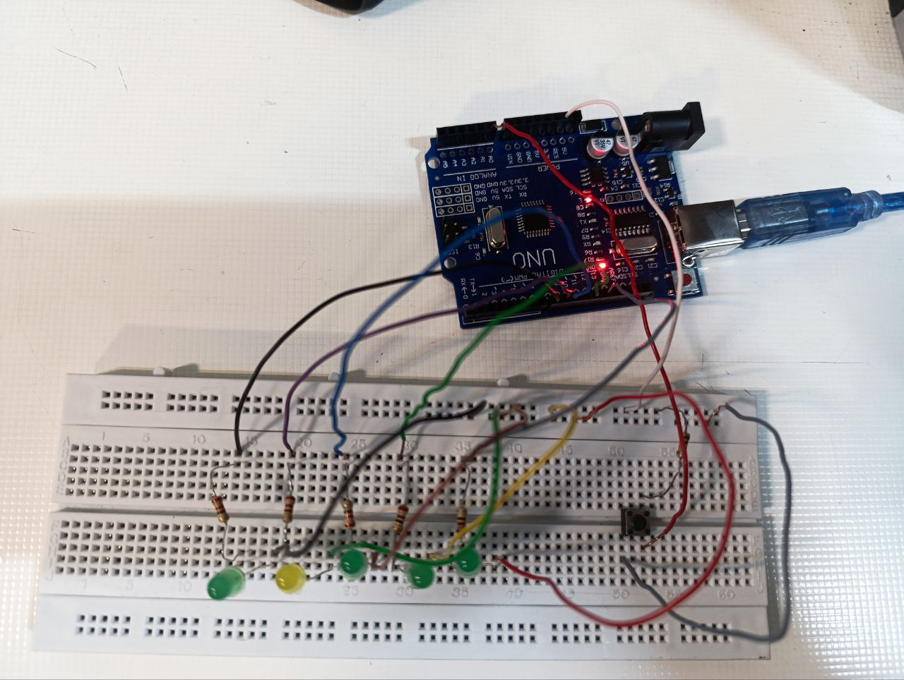

عنوان : برنامه ای بنویسید که با فشردن کلید ، الگوی زیر را به صورت رقص نور اجرا کند
× • • • •
× × • • •
• × × • •
• • × × •
• • • × ×
• • • • ×
هدف آزمایش : درست کردن یک رقص نور به وسیله برد آردینو 
 ابزار و تجهیزات: بردآردینو ، بردبورد، ۵ عدد ال ای دی ، ۵ عدد مقاومت ۲.۲  و یک عدد مقاومت  ۱ کیلو اهمی ، سیم مخابراتی ، یک عدد کلید 
شرح آزمایش :
"بخش مدار"
با کابل usb برد آردینو را به سیستم متصل میکنیم
۵ لامپ را در یک ردیف از برد بورد قرار میدهیم و برای هر لامپ ، مقامومتی به اندازه ۲.۲ کیلو اهم در یک ستون از پایه های مثبت قرار داده و از هر مقاومت را با سیم به پایه های شماره ۸ تا ۱۳ متصل میکنیم
و پایه منفی ال ای دی ها را به بخش زمین برد بورد متصل میکنیم
کلید را بین دو بخش میانی برد بورد وصل می کنیم 
یکی از پایه های کلید را به A0  برد آردینو و پایه روبه رو آن را با مقاومت ۱ کیلو اهمی به بخش اول برد بورد اتصال می دهیم و با یک سیم که به ۵ ولت برد آردینو متصل است ردیفی که مقاومت کلید متصل است را دارای ولتاژ ۵ میکنیم
و یکی از پایه های باقی مانده را به زمین متصل میکنیم



"بخش کد"
```ccp
const int ledPins[] = {8, 9, 10, 12, 13};//تعریف آرایه لامپ ها
const int buttonPin = A0;//مقدار کلید
bool buttonState = LOW;//حالت کلید
void setup() {
  for (int i = 0; i < 5; i++)
  {
    pinMode(ledPins[i], OUTPUT);//تغیر حالت خروجی 
  }
  pinMode(buttonPin, INPUT);//حالت خروجی کلید

}

void loop() {
  buttonState = digitalRead(buttonPin);//خواندن حالت کلید

  if (buttonState == LOW)
  {
    lightSequence();//اجرای ایین تابع
  }
}
void lightSequence() {//تعریف الگو
  digitalWrite(ledPins[0], HIGH);
    digitalWrite(ledPins[1],LOW);
    digitalWrite(ledPins[2],LOW);
    digitalWrite(ledPins[3],LOW);
    digitalWrite(ledPins[4],LOW);
  delay(500);

  digitalWrite(ledPins[0], HIGH);
  digitalWrite(ledPins[1], HIGH);
  digitalWrite(ledPins[2],LOW);
  digitalWrite(ledPins[3],LOW);
  digitalWrite(ledPins[4],LOW);
  delay(500);

  digitalWrite(ledPins[1], HIGH);
  digitalWrite(ledPins[2], HIGH);
  digitalWrite(ledPins[0],LOW);
  digitalWrite(ledPins[3],LOW);
  digitalWrite(ledPins[4],LOW);
  delay(500);

  digitalWrite(ledPins[2], HIGH);
  digitalWrite(ledPins[3], HIGH);
  digitalWrite(ledPins[1],LOW);
  digitalWrite(ledPins[4],LOW);
  digitalWrite(ledPins[0],LOW);
  delay(500);

  digitalWrite(ledPins[3], HIGH);
  digitalWrite(ledPins[4], HIGH);
  digitalWrite(ledPins[1],LOW);
  digitalWrite(ledPins[2],LOW);
  digitalWrite(ledPins[0],LOW);
  
  delay(500);


  digitalWrite(ledPins[4], HIGH);
   digitalWrite(ledPins[1],LOW);
  digitalWrite(ledPins[2],LOW);
  digitalWrite(ledPins[0],LOW);
  digitalWrite(ledPins[3],LOW); 
  delay(500);
}
```

نتیجه گیری :
پس از آپلودا فشردن کلید، ال ای دی را به طور متناوب روشن و خاموش می‌کند و الگویی از رقص نور ایجاد می‌کند