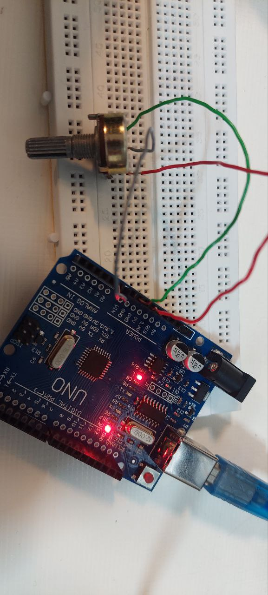

عنوان : برنامه ای بنویسید که پایه وسط پتاسیم متر را خوانده و به صورت یک عدد در بازه 0 -5 ولت در سریال مانیتور چاپ کند
ابزار و تجهیزات : پتاسیم متر 10کیلو ، برد آردینو ، برد بورد ، دو عدد سیم
شرح
"بخش مدار"
پتاسیم متر را روی برد بورد قرار می دهیم
0Aبا استفاده از یک سیم پایه سمت راست را به زمین بردآردینو ، پایه وسط را به
  و پایه سمت چپ را به 5 ولت برد متصل میکنیم



"بخش کد"

```ccp

const int p = A0; // پایه آنالوگ برای پتاسیم‌متر

void setup() {
  Serial.begin(9600); // راه‌اندازی ارتباط سریال
}

void loop() {
  int s = analogRead(p); // خواندن مقدار آنالوگ
  float v = s * (5.0 / 1023.0); // تبدیل به ولتاژ (0-5V)
  Serial.println(v);
   // نمایش ولتاژ در سریال مانیتور
  
  delay(100); // تاخیر برای خواندن مجدد
}
```
پس از آپلود و باز کردن سریال مانیتور مشاهده میکنیم که:

نتیجه گیری: با پیچاندن پیچ پتاسیم متر ، مقدار ولتاژ متغیر پتاسیم روی سریال مانیتور به نمایش در می آید
