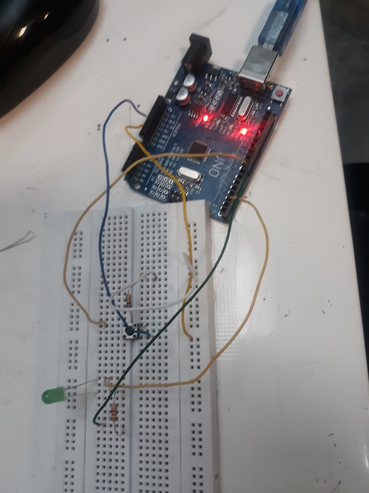

آزمایش 3و4:

عنوان آزمایش:

راه اندازی کلید به صورت پایین و بالا کش و روشن کردن لامپ

وسایل مورد نیاز:

1.Arduino Uno (یا هر مدل دیگری از Arduino)
2.کلید فشاری (Push Button)
3.ال‌ای‌دی (LED) یا لامپ کوچک
4.مقاومت (برای کلید و ال‌ای‌دی)
5.برد بورد و سیم‌های اتصال

هدف آزمایش:

کلید به گونه‌ای عمل کند که با فشار دادن آن، وضعیت لامپ (یا LED) تغییر کند. در این حالت، کلید به گونه‌ای طراحی شده که وقتی فشار داده می‌شود، وضعیت آن از "غیرفعال" به "فعال" تغییر می‌کند. این عملیات به عنوان پایین کشیدن (falling edge) شناخته می‌شود.

شرح آزمایش:

تعریف پین‌ها:

پین 2 به عنوان ورودی برای خواندن وضعیت کلید و پین 13 به عنوان خروجی برای کنترل ال‌ای‌دی تعریف شده است.
از INPUT_PULLUP برای کلید استفاده می‌شود، که یعنی هنگامی که کلید فشرده نیست، پین 2 به سطح بالای 5 ولت (HIGH) می‌رود و هنگامی که کلید فشرده می‌شود، پین به سطح پایین (LOW) می‌رود.

خواندن وضعیت کلید:

وضعیت کلید در هر دور از تابع loop() با digitalRead(buttonPin) خوانده می‌شود.
اگر وضعیت کلید از "غیرفعال" (HIGH) به "فعال" (LOW) تغییر کند، یعنی کلید فشرده شده است و باید وضعیت ال‌ای‌دی تغییر کند.

پایین کش (Falling Edge):

کد به گونه‌ای نوشته شده است که فقط زمانی که کلید از حالت غیر فشرده به فشرده (یعنی از HIGH به LOW) تغییر وضعیت می‌دهد، عملیات تغییر وضعیت ال‌ای‌دی انجام شود.

Debouncing:

برای جلوگیری از لرزش کلید، از یک تأخیر 50 میلی‌ثانیه‌ای استفاده شده است. این کار باعث می‌شود که کلید ناهماهنگ (چند بار فشرده شدن در یک زمان کوتاه) اثر نگذارد.

بخش مدار:

در این آزمایش، به صورت زیر اجزا را به Arduino متصل می‌کنیم:

کلید به پین 2 Arduino متصل می‌شود. برای خواندن وضعیت کلید از پین، از مقاومت داخلی (INPUT_PULLUP) استفاده می‌کنیم.
ال‌ای‌دی به پین 13 Arduino متصل می‌شود. یک مقاومت 220 اهمی به‌صورت سری با آناود ال‌ای‌دی قرار می‌دهیم تا از آسیب‌دیدن ال‌ای‌دی جلوگیری کنیم.

بخش عکس پایین کش:



بخش گیف پایین کش:


بخش شماتیک پایین کش:


بخش کد پایین کش:

```cpp
int buttonPin = 8; 
int ledPin = 2; 
int buttonState = 0; 
void setup() {
pinMode(ledPin, OUTPUT);
pinMode(buttonPin, INPUT); }
void loop() {
buttonState = digitalRead(buttonPin);
if (buttonState == HIGH) {
digitalWrite(ledPin, HIGH); }
else {
digitalWrite(ledPin, LOW);
}
}
```cpp

بخش کد بالا کش:

```cpp
int buttonPin = 8; 
int ledPin = 2; 
int buttonState = 0; 
void setup() {
pinMode(ledPin, OUTPUT);
pinMode(buttonPin, INPUT); }
void loop() {
buttonState = digitalRead(buttonPin);
if (buttonState == LOW) {
digitalWrite(ledPin, HIGH); }
else {
digitalWrite(ledPin, LOW);
}
}
```cpp

نتیجه آزمایش پایین کش:

در این آزمایش، زمانی که کلید فشرده می‌شود، وضعیت ال‌ای‌دی تغییر می‌کند و روشن یا خاموش می‌شود. این عملکرد می‌تواند برای بسیاری از پروژه‌های کاربردی در کنترل روشنایی یا سایر دستگاه‌ها مورد استفاده قرار گیرد.

نتیجه آزمایش بالا کش:

در این آزمایش، زمانی که کلید فشرده می‌شود، وضعیت ال‌ای‌دی تغییر می‌کند و روشن یا خاموش می‌شود. این عملکرد می‌تواند برای بسیاری از پروژه‌های کاربردی در کنترل روشنایی یا سایر دستگاه‌ها مورد استفاده قرار گیرد.

