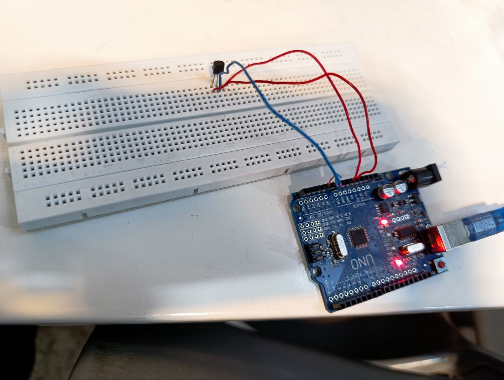

عنوان : نمایش دمای محیط روی سریال مانیتور با استفاده از سنسور LM35 در دو واحد دما (سلسیوس و فارنهایت)

ابزار و تجهیزات : برد بورد ،برد آردینو، سنسور LM35

هدف : نمایش دمای محیط

شرح آزمایش

بخش مدار

سنسور را روی برد بورد متصل میکنیم 
با سیم مخابراتی پایه چپ آن را به 5 ولت آردینو ، پایه وسط به یکی از پین های

 A0~A5 
 
و پایه راست آن را به زمین آردینو وصل میکنیم

بخش کد

این کد مربوط به یک برنامه Arduino است که به منظور خواندن دما از یک سنسور آنالوگ و نمایش آن در دو واحد دما (سلسیوس و فارنهایت) طراحی شده است. در ادامه، تحلیل کد را به تفصیل شرح می‌دهم:

1. تعریف پین سنسور:
   - #define sensorPin A1: این خط پین آنالوگ A1 را به عنوان پین ورودی سنسور تعریف می‌کند.

### تابع setup()
- Serial.begin(9600);: این خط ارتباط سریال را با سرعت 9600 بیت در ثانیه آغاز می‌کند. این ارتباط برای ارسال داده‌ها به کامپیوتر یا سایر دستگاه‌ها استفاده می‌شود.

### تابع loop()
- این تابع به طور مکرر اجرا می‌شود و شامل مراحل زیر است:

1. خواندن داده‌های آنالوگ:
   - int reading = analogRead(sensorPin);: این خط مقدار آنالوگ خوانده شده از سنسور را از پین A1 می‌خواند. مقدار خوانده شده بین 0 تا 1023 خواهد بود.

2. محاسبه ولتاژ:
   - float voltage = reading * (5.0 / 1024.0);: این خط مقدار ولتاژ را بر اساس خواندن آنالوگ محاسبه می‌کند. با توجه به اینکه ولتاژ مرجع Arduino معمولاً 5 ولت است و مقدار خوانده شده بین 0 تا 1023 است، ولتاژ محاسبه می‌شود.

3. محاسبه دما در سلسیوس:
   - float temperatureC = voltage * 100;: این خط دما را بر اساس ولتاژ محاسبه می‌کند. فرض بر این است که سنسور دما به ازای هر 1 ولت، 100 درجه سلسیوس را نشان می‌دهد.

4. چاپ دما در سلسیوس:
   - Serial.print("Temperature: ");: این خط متن "Temperature: " را چاپ می‌کند.
   - Serial.print(temperatureC);: دمای محاسبه شده در سلسیوس را چاپ می‌کند.
   - Serial.print("\xC2\xB0");: این خط نماد درجه (°) را چاپ می‌کند.
   - Serial.print("C  |  ");: این خط واحد سلسیوس را چاپ می‌کند.

5. محاسبه دما در فارنهایت:
   - float temperatureF = (temperatureC * 9.0 / 5.0) + 32.0;: دما در فارنهایت محاسبه می‌شود.

6. چاپ دما در فارنهایت:
   - Serial.print(temperatureF);: دمای محاسبه شده در فارنهایت را چاپ می‌کند.
   - Serial.print("\xC2\xB0");: نماد درجه (°) را چاپ می‌کند.
   - Serial.println("F");: واحد فارنهایت را چاپ کرده و خط را به پایان می‌رساند.

7. تأخیر:
   - delay(1000);: این خط باعث می‌شود که برنامه به مدت 1 ثانیه (1000 میلی‌ثانیه) متوقف شود قبل از اینکه دوباره حلقه loop() اجرا شود.

### نتیجه‌گیری
به طور مؤثر دما را از یک سنسور آنالوگ خوانده و آن را در دو واحد سلسیوس و فارنهایت به صورت سریال نمایش می‌دهد. این برنامه می‌تواند برای پروژه‌های مربوط به دما یا نظارت بر شرایط محیطی مورد استفاده قرار گیرد.