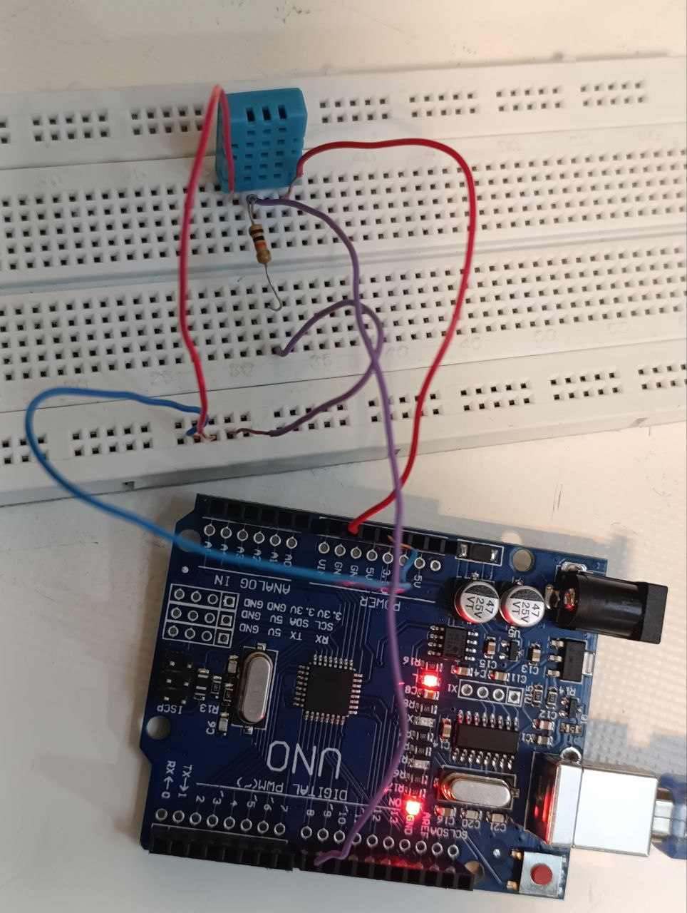

عنوان : نمایش رطوبت محیط روی سریال مانیتور

ابزار و تجهیزات : برد بورد ، برد آردینو ، مقاومت یک اهمی ، سنسور DHT11

هدف : نمایش رطوبت

شرح آزمایش

بخش مدار 

سنسور را روی برد بورد قرار داده و با سیم مخابراتی به صورت زیر پایه های آن را به برد آردینو وصل میکنیم

پایه راست : زمین

پایه دوم :  ـــــــ

پایه سوم : با مقاومت متصل به 5 ولت و پین 8

پایه آخر : 5 ولت

بخش کد

ابتدا کتابخانه را طبق مراحل زیر به آردینو اضافه میکنیم

Sketch > includeLibrary  > Add Zip library

و پس از نصب کد را وارد میکنیم

شامل کردن کتابخانه:
  

   #include "DHT.h"
   

   این خط کتابخانه DHT.h را شامل می‌کند که برای کار با سنسورهای DHT استفاده می‌شود.

 تعریف پین و نوع سنسور:
  

   #define DHTPIN 8

   #define DHTTYPE DHT11
   

   در اینجا، پین ۸ به عنوان پین ورودی سنسور DHT11 تعریف شده است.

 ایجاد شیء DHT:
  

   DHT dht (DHTPIN, DHTTYPE);
   

   یک شیء از کلاس DHT ایجاد می‌شود که به پین و نوع سنسور اشاره می‌کند.

void setup()
   {
     Serial.begin(9600);
     dht.begin();
   }

 ایجاد راه ارتباطی با سریال مانیتور و کتابخانه

   void loop()
   {
     float t = dht.readTemperature();
     float h = dht.readHumidity();
   

در اینجا، دما (t) و رطوبت (h) خوانده می‌شود.

   Serial.print("Temperature = ");
   Serial.print(t);
   Serial.print(" ");
   Serial.print((char)176);
   Serial.print(" C | ");
   Serial.print((t * 9.0) / 5.0 + 32.0);
   Serial.print(" ");
   Serial.print((char)176);
   Serial.println("F ");
   Serial.print("Humidity = ");
   Serial.print(h);
   Serial.println(" % ");
   Serial.println("");
   

دما به درجه سلسیوس و فارنهایت چاپ می‌شود. (محاسبات تبدیل سلسیوس به فارنهایت)

 delay(2000);
   

   برنامه به مدت ۲ ثانیه متوقف می‌شود تا از خواندن مکرر داده‌ها جلوگیری کند.

نتیجه‌گیری:

این کد به خوبی دما و رطوبت را از سنسور DHT11 می‌خواند و آن‌ها را در سریال مانیتور نمایش می‌دهد