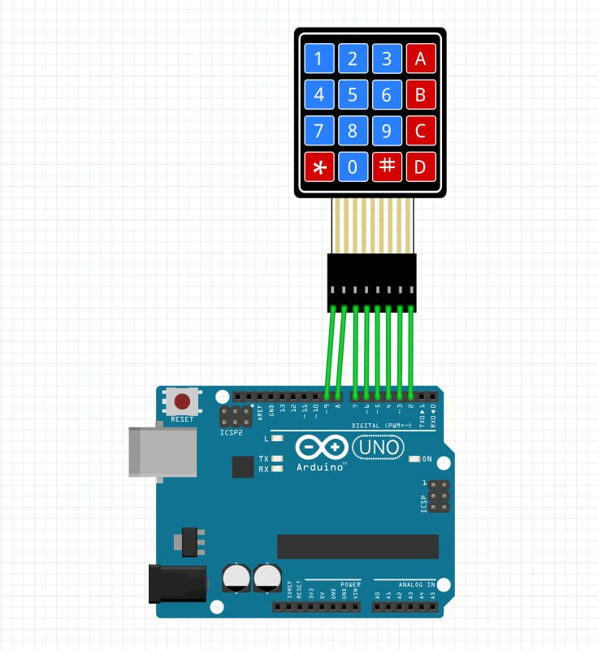
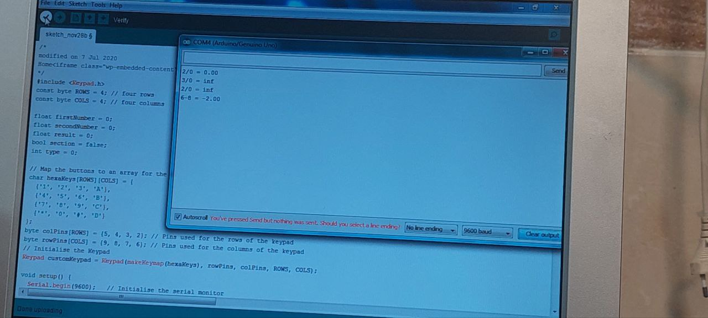

به نام  خدا 

•عنوان آزمایش:  ساخت یک ماشین حساب به وسیله کی پد در محیط اردینو 

•ابزار و تجهیزات: برد آردینو ، کی پد ، ۶ عدد سیم مخابراتی 

•شرح آزمایش: 
ابتدا برد اردینو را به وسیله یک کابل یو اس بی به سیستم وصل میکنیم  
 مدار: 

در این ازمایش میخواهیم ک به وسیله کی پد وقتی در سریال مانیتور به آن ورودی می دهیم برای ما در سریال مانیتور به صورت خروجی نشان دهد.
از سمت راست کی پد یک سیم مخابراتی به خانه شماره ۲ و اینکار را تا خانه شماره ۹ ادامه می دهیم .

  
قسمت‌کد :

در این قسمت از skatch  قسمت کتابخانه را انتخاب میکنیم و گزینه keypad را انتخاب میکنیم .

```cpp
#include <Keypad.h>  \\این خط کتابخانه Keypad را شامل می‌کند که برای کار با کی‌پد استفاده می‌شود.
const byte ROWS = 4; \\در اینجا تعداد ردیف‌ها و ستون‌های کی‌پد تعریف شده است. کی‌پد ما ۴ ردیف و ۴ ستون دارد.
const byte COLS = 4; 

float firstNumber = 0; \\firstNumber و secondNumber: برای ذخیره دو عدد ورودی از کاربر.
float secondNumber = 0;
float result = 0; \\result: برای ذخیره نتیجه محاسبات.
bool section = false; \\section: برای تعیین اینکه در حال وارد کردن عدد اول هستیم یا دوم.
int type = 0; \\type: برای مشخص کردن نوع عملگر (جمع، تفریق، ضرب، تقسیم).


char hexaKeys[ROWS][COLS] = { \\. تعریف کلیدهای کی‌پد
  {'1', '2', '3', 'A'},
  {'4', '5', '6', 'B'},
  {'7', '8', '9', 'C'},
  {'*', '0', '#', 'D'}
};
byte colPins[ROWS] = {5, 4, 3, 2}; \\ تعریف پین‌های ردیف و ستون
byte rowPins[COLS] = {9, 8, 7, 6}; 

Keypad customKeypad = Keypad(makeKeymap(hexaKeys), rowPins, colPins, ROWS, COLS); \\در این خط یک شیء از نوع Keypad ایجاد می‌شود که با استفاده از آرایه‌های قبلی پیکربندی شده است.

void setup() {
  Serial.begin(9600);   
}

void loop() {
  
  int button = int(customKeypad.getKey()) - 48; \\این خط دکمه فشرده شده را خوانده و آن را به عدد صحیح تبدیل می‌کن
  if (0 <= button && button <= 10) {
    Serial.print(button);
    if (section == false) { \\وارد کردن عدد اول یا دوم
      firstNumber = firstNumber * 10 + button;
    } else {
      secondNumber = secondNumber * 10 + button;
    }
  } else { \\بررسی عملگرها
    switch (button) {
      case 17://A

        section = true;
        type = 1;
        Serial.print('+');
        break;
      case 18://///B

        section = true;
        type = 2;
        Serial.print('-');
        break;
      case 19:////C

        section = true;
        type = 3;
        Serial.print('*');
        break;
      case 20:////D

        section = true;
        type = 4;
        Serial.print('/');
        break;
      case -6:////*

        section = false;
        type = 0;
        Serial.println(' ');
        break;

      case -13://///#
        Serial.print(" = ");
        switch (type) {
          case 1:
            result = (firstNumber + secondNumber);
            break;
          case 2:
            result = (firstNumber - secondNumber);
            break;
          case 3:
            result = (firstNumber * secondNumber);
            break;
          case 4:
            result = (firstNumber / secondNumber);
            break;
        }
        type = 0;
        Serial.println(result);
        firstNumber = 0;
        secondNumber = 0;
        section = false;
        break;  \\وقتی کاربر دکمه # را فشار دهد، نتیجه محاسبه شده و چاپ می‌شود.

    }
  }
}
```
و سپس ان را اپلود میکنیم و از طریق دکمه های کی پد در سریال مانیتور به ان ورود می دهیم۰

 

نتیجه‌گیری

این کد یک ماشین حساب ساده با استفاده از کی‌پد در آردوینو ایجاد می‌کند که قادر است عملیات جمع، تفریق، ضرب و تقسیم را انجام دهد. کاربر با فشار دادن دکمه‌ها اعداد و عملگرها را وارد کرده و نتیجه را مشاهده می‌کند.
