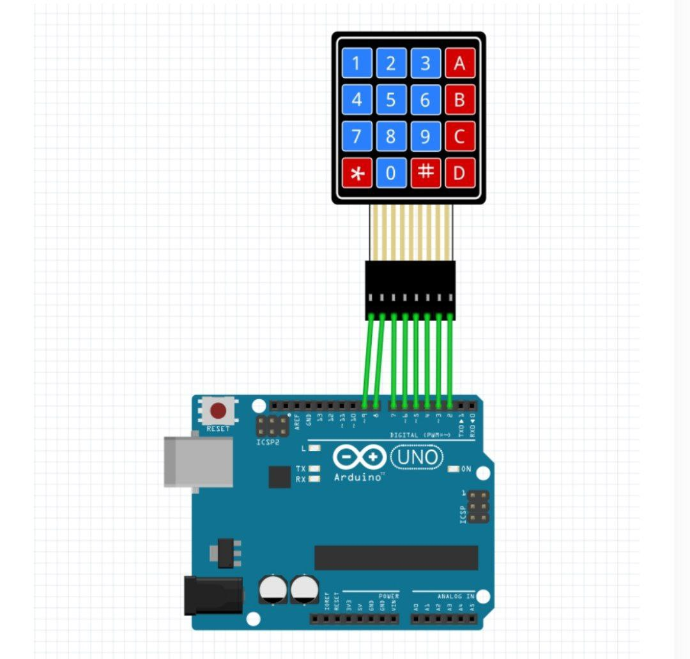
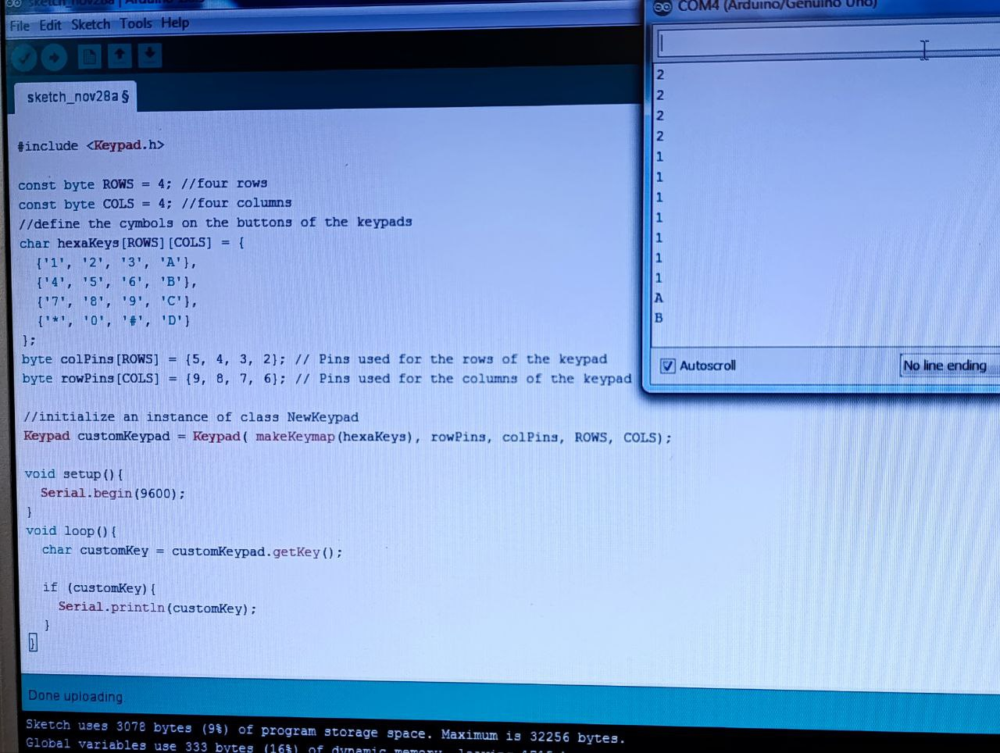

به نام  خدا 

•عنوان آزمایش: آموزش راه اندازی کی پد  با آردینو 

•ابزار و تجهیزات: برد آردینو ، کی پد ، ۶ عدد سیم مخابراتی 

•شرح آزمایش: 

ابتدا برد اردینو را به وسیله یک کابل یو اس بی به سیستم وصل میکنیم  
 مدار: 
در این ازمایش میخواهیم ک به وسیله کی پد وقتی در سریال مانیتور به آن ورودی می دهیم برای ما در سریال مانیتور به صورت خروجی نشان دهد.
از سمت راست کی پد یک سیم مخابراتی به خانه شماره ۲ و اینکار را تا خانه شماره ۹ ادامه می دهیم .
 
   


قسمت‌کد :


در این قسمت از skatch  قسمت کتابخانه را انتخاب میکنیم و گزینه keypad را انتخاب میکنیم .

```cpp
#include <Keypad.h> \\ین خط کتابخانه Keypad را به برنامه اضافه می‌کند.

const byte ROWS = 4; \\ تعریف متغیرها
const byte COLS = 4;

char hexaKeys[ROWS][COLS] = { \\این آرایه دو بعدی شامل کاراکترهای موجود بر روی کی‌پد است. هر ردیف نمایانگر یک ردیف از کلیدها در کی‌پد است.
  {'1', '2', '3', 'A'},
  {'4', '5', '6', 'B'},
  {'7', '8', '9', 'C'},
  {'*', '0', '#', 'D'}
};
byte colPins[ROWS] = {5, 4, 3, 2}; \\ تعریف پین‌ها
byte rowPins[COLS] = {9, 8, 7, 6};
Keypad customKeypad = Keypad( makeKeymap(hexaKeys), rowPins, colPins, ROWS, COLS);  \\در این خط، یک شیء از نوع Keypad به نام customKeypad ایجاد می‌شود. تابع makeKeymap آرایه کلیدها را به فرمت قابل استفاده برای کتابخانه تبدیل می‌کند.

void setup(){
  Serial.begin(9600);
}
void loop(){
  char customKey = customKeypad.getKey(); \\در تابع loop، برنامه به طور مداوم بررسی می‌کند که آیا کلیدی از کی‌پد فشرده شده است یا خیر.
  
  if (customKey){
    Serial.println(customKey);
  }
}
```
و سپس ان را اپلود میکنیم و از طریق دکمه های ک پد در سریال مانیتور به ان ورود می دهیم۰

نتیجه‌گیری


این کد یک برنامه پایه برای خواندن ورودی از یک کی‌پد و ارسال آن به کنسول سریال است. با فشردن هر کلید بر روی کی‌پد، کاراکتر مربوطه در سریال مانیتو نمایش داده می شود.
 
 
