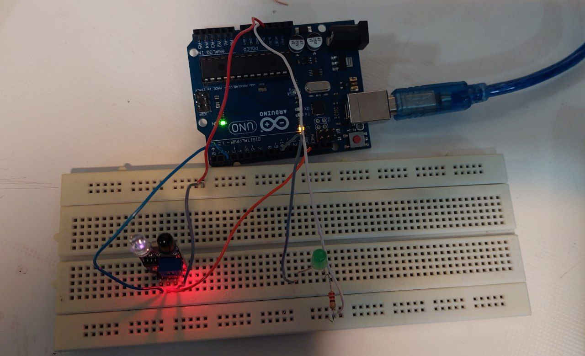

به نام خدا 

● عنوان آزمایش :
برنامه ای بنویسید که در صورت تشخیص مانع ، ال ایی دی  روی پایه ۱۰ را روشن کند  و در غیر این صورت خاموش کند .

●ابزار و تجهیزات :
برد بورد ، برد آردینو ، ماژول مادون قرمز ، مقاومت ، ال ایی دی ، سیم مخابراتی 

● شرح آزمایش : 
ابتدا برد اردینو را به وسیله کابل به سیستم متصل میکنیم .

مدار :
ابتدا ماژول مادو قرمز را در برد بورد قرار می دهیم و پایه out  آن را به خانه شماره دو  و پایه  زمین آن به زمین آردینو متصل شده و پایه VCC  آن به ۵ ولت آردینو متصل است . 
ال ایی دی و مقاومت را در مدار قرار می دهیم پایه مثبت آن به خانه شماره ۱۰ و پایه منفی آن با مقاومت به زمین متصل شده است .


کد :


کد برنامه به این صورت است .

ما در برنامه این پروژه، برای پین دیجیتال شماره 2  آردوینو یعنی جایی که خروجی سنسور تشخیص مانع متصل شده است، متغیری به نام “ir” تعریف کرده‌ایم.
 همچنین برای پین دیجیتال شماره 10 یعنی جایی که LED متصل شده است متغیری تحت عنوان ” PinLed” ایجاد نموده‌ایم.

```cpp

int ir = 2;
    int PinLed = 10;
در تابع ()setup، متغیر “ir” را به‌عنوان ورودی و متغیر ” PinLed” را به‌عنوان خروجی تنظیم می‌کنیم.    


pinMode(ir, INPUT);
    pinMode(PinLed, OUTPUT);

```
نتیجه گیری


در تابع ()loop وجود مانع بررسی می‌شود و این امر توسط یک if-else ساده انجام می‌شود. تابع ()digitalRead به‌عنوان شرط دستور if قرار می‌گیرد.
 این یک روش کوتاه به جای نوشتن یک دستور digitalRead جداگانه قبل از دستور 
if است. (یادآوری: نماد “==” دو عبارت را مقایسه می‌کند که آیا با یکدیگر برابر هستند یا خیر؛ درحالی‌که نماد “=” یک مقدار به متغیر اختصاص می‌دهد.)

چنانچه پاسخ شرط درست باشد، با اجرا شدن کد زیر دستور if، ال‌ای‌دی روشن می‌شود که بیانگر تشخیص مانع است. چنانچه پاسخ شرط نادرست باشد، کد زیر دستور else اجرا می‌شود که در این حالت LED خاموش می‌شود که بیانگر عدم وجود مانع است.


