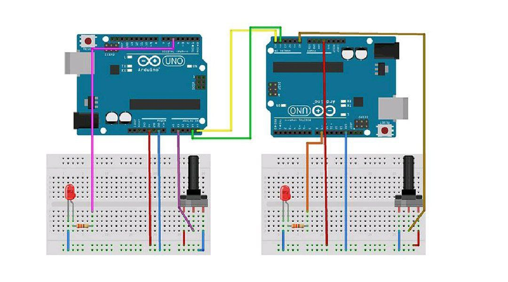

به نام خدا 
slave&master:عنوان آزمایش 
بزار و تجهیزات:برای masterو slaveهرکدام نیاز به یک سخت افزار جدا داریم که شامل :پتاسیم متر ، یک عدد مقاومت، سیم مخابراتی ، بردبورد بورد اردینو، ال ایی دی هستند.
هدف ازمایش: کنترل داده و ارتباط برقرار کردن با چند دستگاه
شرح ازمایش : ما میخواهیم با تعریف دو عبارتmaster& slaveو اتصال ان ها باهمبا هم ارتباط برقرار و تبادل کنند .
در این ازمایش میخواهیم با تغییر پتاسیم متر سمت slave شدت روشنایی ال ایی دی را کم و زیاد کنیم  و این عدد به وسیله سریال مانیتور نمایش داده بشه .
\\\master
●بخش مدار
ابتدا بورد اردینو را به سیستم وصل میکنیم و نوع پورت و بورد ان را انتخاب میکنیم.
پس از ان پتاسیم متر را در مدار قرار می دهیم و پایه چپ ان را با یک سیم به قسمت پایینی بردبورد یا زمین وصل میکنیم و پایه وسط ان را به را به A1 وصل میکنیم و پایه راست ان را نیز به قسمت پایین وصل میکنم . سپس ال ایی دی و مقاومت ۳۳۰ را در مدار قرار می دهیم و در اینجا  و یک سیم از پایه سمت چپ ال ایی دی به زمین وصل میکنیم و یک سیم نیز از بالای مقاومت به خانه شماره ۵ در برد اردینو وصل میکنیم  و با دو سیم دیگر از ردیف اول و دوم قسمت پایین بردبورد به خانه ها 5v  و GND در برد اردینو وصل میکنیم .
  

 ●بخش کد
در این قسمت قبل از وارد کردن ابتدا از کتابخانه اردینو کتابخانه wire  را انتخاب میکنیم .

\\master
```cpp
#include <Wire.h> \\این خط کتابخانه Wire را شامل می‌شود که برای ارتباطات I2C در آردوینو استفاده می‌شود. این کتابخانه توابع لازم برای برقراری ارتباط بین دستگاه‌های Master و Slave را فراهم می‌کند.
int value = 0; \\یک متغیر به نام value تعریف شده است که برای ذخیره‌سازی مقادیر خوانده شده از سنسور یا ورودی آنالوگ استفاده می‌شود.
void setup() {
 Wire.begin(); \\ین تابع کار با کتابخانه را آغاز کرده
 Serial.begin(9600); \\این خط پورت سریال را با سرعت 9600 بیت در ثانیه راه‌اندازی می‌کندبرای ارسال داده به کامپیوتر دیگر .

 pinMode(5, OUTPUT); \\ین خط پین شماره 5 را به عنوان خروجی تنظیم می‌کند. این پین برای کنترل یک LED یا هر دستگاه خروجی دیگری استفاده خواهد شد.
}
void loop() {
 int y = analogRead(A1); \\مقدار آنالوگ خوانده شده از پین A1 (که معمولاً به یک سنسور متصل است) خوانده و در متغیر y ذخیره می‌شود. 
 value = map(y, 0, 1023, 0, 255); \\این خط مقدار y را از دامنه 0 تا 1023 به دامنه 0 تا 255 تبدیل می‌کند
 Wire.beginTransmission(8);  \\آردوینو شروع به انتقال داده‌ها به دستگاه Slave با آدرس 8 می‌کند. آدرس Slave باید قبلاً تنظیم شده باشد.
 Wire.write("Master value : "); \\هم Masterو هم Slaveاز این تابع برای ارسال اطالعات به باس C2Iاستفاده میکنند
 Wire.write(value); 
 Wire.endTransmission(); \\این خط پایان انتقال داده‌ها را اعلام می‌کند و سیگنال ACK را به Slave ارسال می‌کند.
 Wire.requestFrom(8, 1); \\آردوینو از Slave با آدرس 8 درخواست یک بایت داده می‌کند.
 while (Wire.available())  { \\این حلقه بررسی می‌کند که آیا داده‌ای از Slave در دسترس است یا خیر. اگر داده‌ای موجود باشد، حلقه ادامه پیدا می‌کند.
 int c = Wire.read(); \\داده‌ای که از Slave دریافت شده است، خوانده و در متغیر c ذخیره می‌شود.
 
 analogWrite(5, c); \\به پین شماره 5 ارسال می‌شود تا خروجی PWM بر اساس آن تنظیم شود (مثلاً روشنایی یک LED).
 Serial.print("Slave value : ");
 Serial.println(c); \\این دو خط مقدار دریافتی از Slave را بر روی مانیتور سریال چاپ می‌کنند. 
 }
 delay(100); \\برنامه برای مدت 100 میلی‌ثانیه متوقف می‌شود قبل از اینکه دوباره حلقه loop() شروع شود. 
```

\\slave
 بخش مدار 
دراینجا هم طبق شکل بالا مدار slave .  
 ببندیم وابزار و تجهیزات دقیقا مثل الا و توضیحات گفته شده است‌

بخش کد 
```cpp
#include <Wire.h> \\ین تابع کار با کتابخانه را آغاز کرده
int x;
int value=0; 
void setup() {
 Wire.begin(8); \\این خط ارتباط I2C را آغاز می‌کند و آردوینو را به عنوان یک دستگاه Slave با آدرس 8 تنظیم می‌کند.
 Wire.onRequest(requestEvent); \\ه عنوان تابعی که باید هنگام درخواست داده از طرف Master فراخوانی شود، ثبت می‌کند.
 Wire.onReceive(receiveEvent); 
 Serial.begin(9600); 
 pinMode(9,OUTPUT); \\این خط پین شماره 9 را به عنوان خروجی تنظیم می‌کند. این پین برای کنترل یک LED یا هر دستگاه خروجی دیگری استفاده خواهد شد.
}
void loop() {
 delay(100);
 analogWrite(9,x);
 int t=analogRead(A0); \\مقدار آنالوگ خوانده شده از پین A0 (که معمولاً به یک سنسور متصل است) خوانده و در متغیر t ذخیره می‌شود. 
 value=map(t,0,1023,0,255); \\این کار معمولاً برای تطبیق مقادیر آنالوگ با مقادیر قابل قبول برای PWM انجام می‌شود.
}

void receiveEvent() { \\این تابع زمانی فراخوانی می‌شود که داده‌ای از طرف Master دریافت شود.
 while (1 < Wire.available()) { 
 char c = Wire.read(); 
 Serial.print(c); \\در این حلقه، اگر داده‌ای بیشتر از یک بایت موجود باشد، داده‌ها یکی یکی خوانده شده و بر روی مانیتور سریال چاپ می‌شوند.
 }
 x = Wire.read(); 
 Serial.println(x); 
}

void requestEvent() {
 Wire.write(value); 
}
```
و بعد از وارد کردن کد در اخر سخت افزار ما اینگونه است.
   
 ودر نهایت خروجی که باید به ما از طرق سریال مانیتور  بدهد.
  
نتیجه‌گیری:
این دو عبارت یا توابع برای کنترل داد  تبادل ان ین چندین دستگاه عمل کنند یک مرز تبدل واحد به نام مستر و زیر شاخه انرا سلیومیتوان گفت