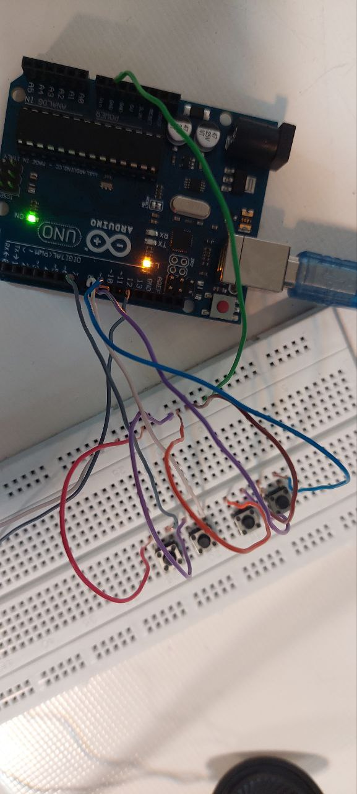

عنوان : ساخت پیانو

ابزار و تجهیزات : بلند گو ، ۴ پوش باتن ،برد آردینو ، برد بورد

هدف : ساخت نوت موسیقی با فشردن پوش باتن ها

شرح آزمایش

بخش مدار 

پوش باتن ها را روی برد بورد متصل و پایه راست هر کدام را به پین های 10-7 متصل و پایه های چپ آنها را به بخش اخر که با استفاده از یک سیم متصل به زمین آردینو ، به بخش زمین برد تبدیل شده وصل میکنیم
یکی از سیم های بلند گو را به همین بخش زمین برد و سیم دیگرش را به پین 12 آردینو وصل می کنیم

بخش کد

تعریف فرکانس‌ها:

   - #define T_C 262
:فرکانس نت C (دو)
   - #define T_D 294
: فرکانس نت D (ر).
   - #define T_E 330
: فرکانس نت E (می).
   - #define T_F 349
: فرکانس نت F (فا).
   

2. تعریف پین‌ها:
 
  - const int C = 10; 
: پین 10 برای نت C.
   - const int D = 9;
: پین 9 برای نت D.
   - const int E = 8;
: پین 8 برای نت E.
   - const int F = 7;
: پین 7 برای نت F.
   - const int buzz = 12;
: پین 12 برای بیزر.

### تابع setup()

- در این تابع، پین‌های C، D، E و F به عنوان ورودی تعریف می‌شوند و به حالت HIGH تنظیم می‌شوند تا از ورود سیگنال‌های ناخواسته جلوگیری شود.

### تابع loop()

- این تابع به طور مکرر اجرا می‌شود و شامل چهار حلقه while است که به بررسی وضعیت پین‌های C، D، E و F می‌پردازد:

  - اگر پین C LOW باشد، بیزر با فرکانس T_C (صدای نت C) فعال می‌شود.
  - اگر پین D LOW باشد، بیزر با فرکانس T_D (صدای نت D) فعال می‌شود.
  - اگر پین E LOW باشد، بیزر با فرکانس T_E (صدای نت E) فعال می‌شود.
  - اگر پین F LOW باشد، بیزر با فرکانس T_F (صدای نت F) فعال می‌شود.

- اگر هیچ یک از پین‌ها LOW نباشند، تابع noTone(buzz); فراخوانی می‌شود که صدای بیزر را خاموش می‌کند.

- این کد به نوعی شبیه به یک پیانوی ساده عمل می‌کند که با فشار دادن دکمه‌های متصل به پین‌های 10، 9، 8 و 7، نت‌های مختلف تولید می‌شود.

- برای هر دکمه، هنگامی که دکمه فشار داده می‌شود (پین LOW می‌شود)، صدای مربوطه تولید می‌شود و تا زمانی که دکمه نگه داشته شود، صدا ادامه دارد.

- در انتهای حلقه، اگر هیچ دکمه‌ای فشار داده نشود، صدای بیزر خاموش می‌شود.

### نتیجه‌گیری

این کد برای تولید صداها بر اساس ورودی‌های دیجیتال طراحی شده و می‌تواند به عنوان پایه‌ای برای پروژه‌های موسیقی یا آموزشی مورد استفاده قرار گیرد.

کد