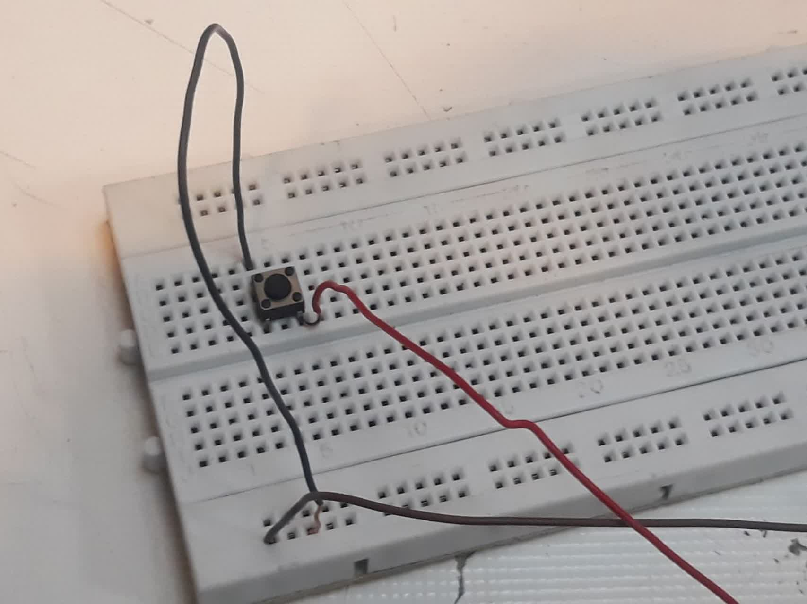
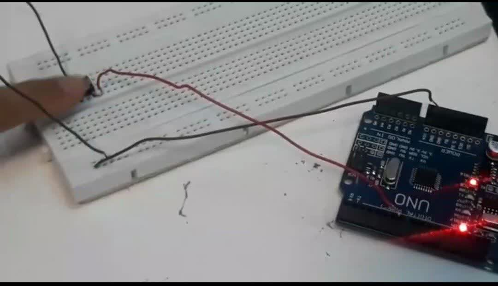

آزمایش2

عنوان آزمایش:

برنامه ای بنویسید که اگر Push Button روی پایه 7 را فشار دهیم،LED پایه 13 خاموش شود و در غیر اینصورت روشن شود.

 وسایل موردنیاز:

دکمه(Push Button),آردینو،بردبورد،۳ عدد سیم

هدف آزمایش:

با فشردن Push Button ال ای دی خاموش شود و روشن می شود.

شرح آزمایش:

ابتدا آردینو را به سیستم وصل کرده سپس push button را روی بردبورد گذاشته و سه عدد سیم را برداشته به ترتیب سر سیم اول را به پایه ۷ آردینو وصل کرده و سر دیگر را به زمین (GND) بردبورد وصل میکنیم،سپس سیم دوم را به پایه 5 ولت آردینو وصل کرده و سر دیگر را به زمین (GND) بردبورد وصل میکنیم و در نهایت سیم سوم را برداشته و به زمین وصل میکنیم سر دیگر را به پایه 7 بالای push button وصل میکنیم.

بخش مدار:






بخش گیف:


بخش شماتیک:

بخش کد:


```cpp
Int ledpin=13; //  و مقدار 13 را تعریف میکند ledpin این خط یک متغییر صحیح با نام  
Int inpin=7; // و مقدار 7 را تعریف میکند inpin این خط یک متغییر صحیح با نام
Int val=0; //  و مقدار 0 را تعریف میکند val این خط یک متغییر صحیح با نام
void setup() { // پیکربندی اجرای برنامه
pinMode(LED_BUILTIN,OUTPUT); //   داخلی است LED خروجی پیکربندی و 13 به عنوان
pinMode(inpin,INPUT); // inpin ورودی 
}
void loop() // وظیفه اصلی برنامه را اجرا میکند
{
val=digitalRead(inpin); // این خط وضعیت پین ورودی (inPin) را می‌خواند و مقدار آن را (۰ یا ۱) در متغیر val ذخیره می‌کند.  digitalRead()  مقدار HIGH (۱) را اگر پین HIGH باشد و LOW (۰) را اگر پین LOW باشد برمی‌گرداند.
digitalWrite(LED_BUILTIN, val); // این خط وضعیت LED داخلی را بر اساس مقدار val تنظیم می‌کند.  اگر val برابر با HIGH (۱) باشد،  LED روشن می‌شود و اگر val برابر با LOWدر کل:  LED خاموش می‌شود.
}
```
نتیجه آزمایش:

درنتیجه در این آزمایش با اجرا کردن کد وقتی دکمه را فشار دهیم آردینو روشن و خاموش میشود.
این برنامه یک مدار ساده‌ی دنبال‌کننده‌ی ورودی را پیاده‌سازی می‌کند.  وضعیت LED داخلی دقیقاً از وضعیت پین ورودی پیروی می‌کند.  اگر به پین ورودی (پین ۷) ولتاژ HIGH اعمال شود،  LED روشن می‌شود و اگر ولتاژ LOW باشد،  LED خاموش می‌شود.  این برنامه می‌تواند برای کنترل LED با استفاده از یک سوئیچ،  سنسور یا هر منبع ورودی دیجیتال دیگر استفاده شود.

