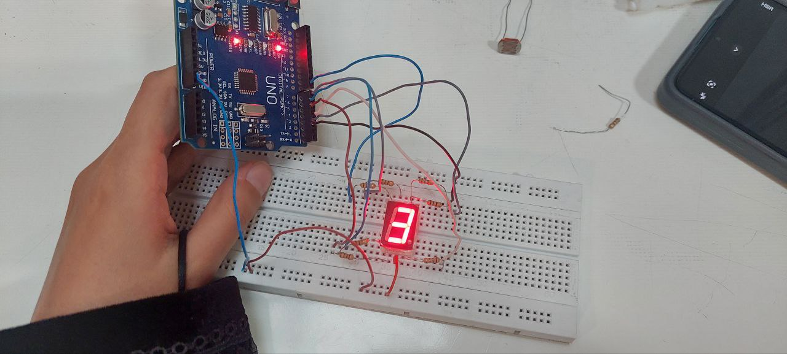

عنوان : نمایش شمارش روی سون سگمنت تکی 


الف) بدون کتابخانه


ابزار و تجهیزات :  ۶ مقاومت ، سیم مخابراتی ، سون سگمنت ، برد بورد ، برد آردینو


هدف : نمایش اعداد 0 تا 9 

شرح آزمایش


بخش مدار

ابتدا برد آردینو را به سیستم متصل میکنیم
نمایشگر سون سگمنت را بین دو بخش میانی برد بورد متصل میکنیم و هر پایه آن را طبق جدول زیر ابتدا به مقاومت و سپس به برد آردینو وصل میکنیم

seven.                     Uno

------------                 -----------

10.                             7

9.                               6

1.                               5

2.                               4

3.                              GND Breadboard

4.                              3

6.                              2

7.                              1

پایه 3 نمایشگر با یک سیم بدون داشتن مقاومت به بخش اخر برد بورد برده  و با یک سیم دیگر زمین برد آردینو را به این بخش از برد بورد وصل می کنیم



```ccp
int sequence[][7] = {
  {1, 1, 1, 1, 1, 1, 0}, //0
  {0, 1, 1, 0, 0, 0, 0}, //1
  {1, 1, 0, 1, 1, 0, 1}, //2
  {1, 1, 1, 1, 0, 0, 1}, //3
  {0, 1, 1, 0, 0, 1, 1},//4
  {1, 0, 1, 1, 0, 1, 1}, //5
  {1, 0, 1, 1, 1, 1, 1}, //6
  {1, 1, 1, 0, 0, 0, 0}, //7
  {1, 1, 1, 1, 1, 1, 1},//8
  {1, 1, 1, 1, 0, 1, 1} //9
};


void printNumber(int number)
{
  for (int i = 0; i < 7; i++)
  {
    digitalWrite(1 + i, sequence[number][i]);
  }
}
void setup() {
  for (int i = 1; i < 8; i++)
  {
    pinMode(i, OUTPUT);


  }
}

void loop() {
  for (int i = 0; i < 10; i++)
  {
    printNumber(i);
    delay(1000);

  }
}
```

ابتدا با 0 و 1 الگوریتم اعداد را تعریف میکنیم
سپس با تابع printNumber
وضعیت پایه های نمایشگر را بر اساس آرایه  
sequence
تنظیم و هر پایه را به حالت روشن یا خاموش تغییر می دهد
سپس پین های آردینو را با یک حلقه فور به عنوان خروجی تنظیم میکنیم
سپس با تابع لوپ هر عدد را با وقفه ۱ ثانیه ای  نمایش می دهد

نتیجه :  نمایشگر سون سگمنت را به سادگی کنترل و اعداد 0 تا 9 را به صورت متوالی نمایش  می دهد.