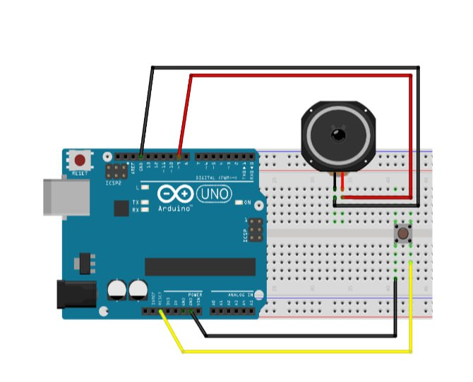

عنوان آزمایش: تولید صدا با استفاده از بلندگو

ابزار و تجهیزات : بلندگو ، برد بورد ، پوش باتن

هدف : تولید صدا با فشردن دکمه

شرح آزمایش 

بخش مدار

پوش باتن را بین دو قسمت میانی برد بورد قرار داده و پایه سما راست آن را به به پین Reset و پایه سمت چپ آن را به زمین آردینو وصل میکنیم

سیم مثبت بلندگو را به پین 9 و منفی آن را به زمین آردینو وصل میکنیم

 

بخش کد

ابتدا با از طریق فشردن  

Ctrl+Shift+N 

صفحه ای باز می شود که در آن نت های ملودی را قرار میدهیم و اسم آن را pitches.h می گذاریم :

```cpp
#define NOTE_B0 31
#define NOTE_C1 33
#define NOTE_CS1 35
#define NOTE_D1 37
#define NOTE_DS1 39
#define NOTE_E1 41
#define NOTE_F1 44
#define NOTE_FS1 46
#define NOTE_G1 49
#define NOTE_GS1 52
#define NOTE_A1 55
#define NOTE_AS1 58
#define NOTE_B1 62
#define NOTE_C2 65
#define NOTE_CS2 69
#define NOTE_D2 73
#define NOTE_DS2 78
#define NOTE_E2 82
#define NOTE_F2 87
#define NOTE_FS2 93
#define NOTE_G2 98
#define NOTE_GS2 104
#define NOTE_A2 110
#define NOTE_AS2 117
#define NOTE_B2 123
#define NOTE_C3 131
#define NOTE_CS3 139
#define NOTE_D3 147
#define NOTE_DS3 156
#define NOTE_E3 165
#define NOTE_F3 175
#define NOTE_FS3 185
#define NOTE_G3 196
#define NOTE_GS3 208
#define NOTE_A3 220
#define NOTE_AS3 233
#define NOTE_B3 247
#define NOTE_C4 262
#define NOTE_CS4 277
#define NOTE_D4 294
#define NOTE_DS4 311
#define NOTE_E4 330
#define NOTE_F4 349
#define NOTE_FS4 370
#define NOTE_G4 392
#define NOTE_GS4 415
#define NOTE_A4 440
#define NOTE_AS4 466
#define NOTE_B4 494
#define NOTE_C5 523
#define NOTE_CS5 554
#define NOTE_D5 587
#define NOTE_DS5 622
#define NOTE_E5 659
#define NOTE_F5 698
#define NOTE_FS5 740
#define NOTE_G5 784
#define NOTE_GS5 831
#define NOTE_A5 880
#define NOTE_AS5 932
#define NOTE_B5 988
#define NOTE_C6 1047
#define NOTE_CS6 1109
#define NOTE_D6 1175
#define NOTE_DS6 1245
#define NOTE_E6 1319
#define NOTE_F6 1397
#define NOTE_FS6 1480
#define NOTE_G6 1568
#define NOTE_GS6 1661
#define NOTE_A6 1760
#define NOTE_AS6 1865
#define NOTE_B6 1976
#define NOTE_C7 2093
#define NOTE_CS7 2217
#define NOTE_D7 2349
#define NOTE_DS7 2489
#define NOTE_E7 2637
#define NOTE_F7 2794
#define NOTE_FS7 2960
#define NOTE_G7 3136
#define NOTE_GS7 3322
#define NOTE_A7 3520
#define NOTE_AS7 3729
#define NOTE_B7 3951
#define NOTE_C8 4186
#define NOTE_CS8 4435
#define NOTE_D8 4699
#define NOTE_DS8 4978
```

سپس کد اصلی را در صفحه اصلی مینویسیم :

```cpp
#include "pitches.h" // شامل فایل pitches.h که شامل تعریف نت‌ها است

// تعریف نت‌های ملودی به صورت آرایه
int melody[] = {
    NOTE_C4, NOTE_G3, NOTE_G3, NOTE_GS3, NOTE_G3, 0, NOTE_B3, NOTE_C4
};

// تعریف مدت زمان هر نت به صورت آرایه
// 4 = نت ربع، 8 = نت هشتم و غیره
int noteDurations[] = {
    4, 8, 8, 4, 4, 4, 4, 4 
};

void setup() {
    // حلقه برای تکرار نت‌های ملودی
    for (int thisNote = 0; thisNote < 8; thisNote++) {
        // محاسبه مدت زمان نت: یک ثانیه تقسیم بر نوع نت
        // مثلاً برای نت ربع: 1000 / 4، برای نت هشتم: 1000 / 8 و غیره
        int noteDuration = 1000 / noteDurations[thisNote];

        // پخش نت با استفاده از تابع tone()
        // پارامتر اول شماره پین (در اینجا پین شماره 8)، 
        // پارامتر دوم نت و پارامتر سوم مدت زمان نت
        tone(8, melody[thisNote], noteDuration);

        // توقف برای مدت زمان نت به علاوه 30 میلی‌ثانیه
        delay(noteDuration + 30);
    }
}

void loop() {
    // نیازی به تکرار ملودی نیست؛ بنابراین این تابع خالی است.
}
```
نتیجه : با فشردن پوش باتن مولودی نوشته شده در کلاس pitches.h نواخته می شود.