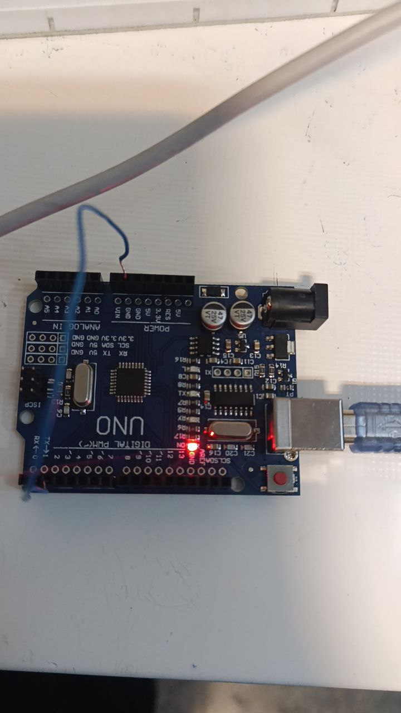

عنوان : وقفه

ابزار و تجهیزات : برد بورد ، سیم مخابراتی

هدف : ایجاد وقفه و برسی آن

شرح آزمایش

بخش مدار

با یک سیم مخابراتی متصل به پایه 2 ، هر بار سر دیگر سیم را به پین 5 ولت یا زمین وصل کنیم

بخش کد

تعریف متغیر سراسری:

  
   volatile bool led_state = LOW;
   

   - یک متغیر سراسری به نام led_state تعریف شده است که وضعیت LED را نگه می‌دارد. از کلیدواژه volatile استفاده شده است تا به کامپایلر بگوید که این متغیر ممکن است در هر لحظه تغییر کند (به‌خصوص در داخل یک وقفه)، بنابراین از بهینه‌سازی‌های غیرمنتظره جلوگیری می‌کند.

2. تابع setup:

  
   void setup()
   {
     pinMode(13, OUTPUT);
     pinMode(2, INPUT_PULLUP);
    
 attachInterrupt(digitalPinToInterrupt(2), blink, FALLING);
   }
   

   - pinMode(13, OUTPUT);

: پین ۱۳ به عنوان خروجی تنظیم می‌شود، که معمولاً به LED متصل است.

   - pinMode(2, INPUT_PULLUP);

: پین ۲ به عنوان ورودی تنظیم می‌شود و حالت INPUT_PULLUP به آن اعمال می‌شود. این به این معنی است که پین به طور پیش‌فرض به ولتاژ بالا (HIGH) متصل است و وقتی دکمه فشرده می‌شود، به LOW تغییر می‌کند.

   -attachInterrupt(digitalPinToInterrupt(2), blink, FALLING);

یک وقفه به پین ۲ متصل می‌شود که وقتی سیگنال به حالت FALLING (از HIGH به LOW) تغییر کند، تابع blink فراخوانی می‌شود.

3. تابع loop:

  
   void loop()
   {
     digitalWrite(13, led_state);
   }

   
   - در حلقه اصلی، وضعیت LED (پین ۱۳) با استفاده از مقدار led_state تنظیم می‌شود. اگر led_state برابر با HIGH باشد، LED روشن می‌شود و اگر LOW باشد، خاموش می‌شود

  
   void blink() {
     led_state = !led_state;
   }

   
   - این تابع مقدار led_state را معکوس می‌کند. اگر LED خاموش باشد، روشن می‌شود و برعکس.

### نتیجه‌گیری:

این کد به خوبی یک LED را کنترل می‌کند که با فشردن یک دکمه (متصل به پین ۲) روشن و خاموش می‌شود. استفاده از وقفه‌ها به این معنی است که برنامه می‌تواند به طور همزمان به دیگر وظایف خود ادامه دهد و فقط در زمان فشردن دکمه، تابع blink اجرا می‌شود. این رویکرد کارا و مؤثر است و به کاربر اجازه می‌دهد تا به سادگی LED را با یک دکمه کنترل کند.